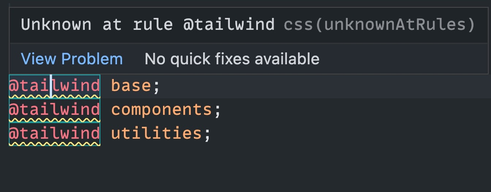

When working with Tailwind CSS in VSCode, you might encounter the "**Unknown at rule @tailwind**" warning. This happens because VS Code’s default CSS support doesn’t recognize custom at-rules like @tailwind.



<h2>Solution 1</h2>

You can install the <a href="https://marketplace.visualstudio.com/items?itemName=bradlc.vscode-tailwindcss" target="_blank">Tailwind CSS IntelliSense</a> extension to fix this issue. This extension provides enhanced Tailwind CSS support for VS Code. Once the extension is installed, you should configure your `settings.json` file to associate CSS files with Tailwind.

```json
  "files.associations": {
    "*.css": "tailwindcss"
  }
```

<h2>Solution 2</h2>

Another way to fix this issue is to configure VSCode to simply ignore the Unknown at Rules warning. You can do this by adding the following line to your `settings.json` file:

```json
  "css.lint.unknownAtRules": "ignore"
```

Both solutions will suppress the Unknown at rule @tailwind warning in VSCode. Choose the one that works best for you!
